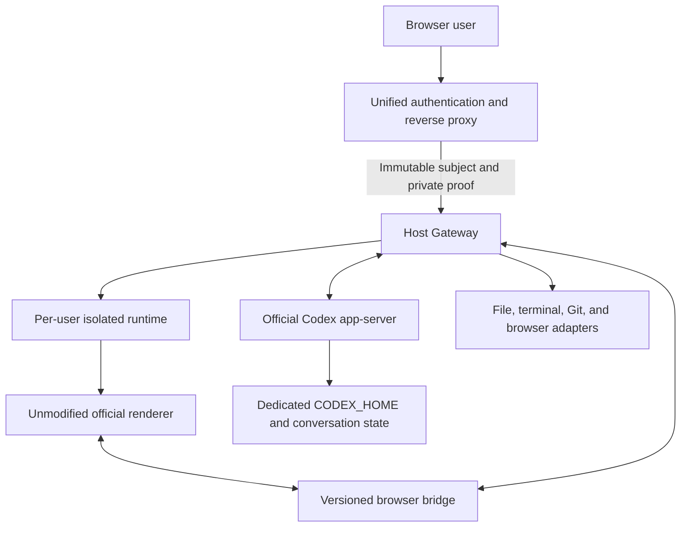
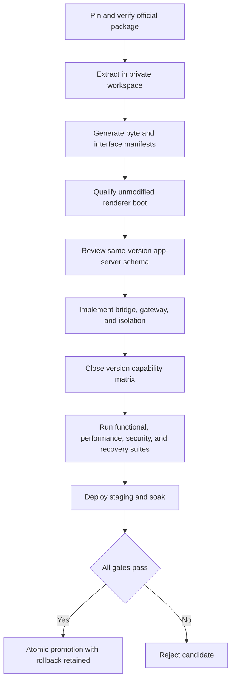

<div align="center">
  

# CodexApp Official Web Host

**Bring a version-locked official desktop renderer to the browser through an isolated, auditable, and reversible host**

[](https://github.com/AIALRA-0/codexapp-linux-web/actions/workflows/ci.yml)
[](package.json)
[](package.json)
[](manifests/official-26.721.31836.json)
[](LICENSE)

[中文](README.md) · [Architecture](#5-architecture) · [Quality gates](#7-validation-and-quality-gates) · [Local validation](#8-local-validation) · [Release boundary](#10-release-and-rollback)
</div>

<div align="center">
  <sub>Figure 1. Boundary among the browser, compatibility bridge, and isolated app-server</sub>
</div>

## 1 Project position

`codexapp-linux-web` is a Linux web compatibility host for CodexApp. It replaces the former custom web client without reimplementing the official user interface [1]

The project places an unchanged, version-locked official ChatGPT/Codex desktop renderer behind a browser compatibility layer and connects it to the matching official Codex app-server. The browser can reach only explicitly declared and audited bridge capabilities

The official ChatGPT application, renderer, images, fonts, and Codex binaries are not included in this repository and are not covered by its MIT license. Operators must obtain an authorized official package and qualify its provenance and integrity before deployment [2]

## 2 Core principles

<div align="center">

Table 2.1. Non-negotiable system constraints

| Constraint                       | Repository enforcement                                                                                                 | Failure result                                             |
| -------------------------------- | ---------------------------------------------------------------------------------------------------------------------- | ---------------------------------------------------------- |
| Preserve the official UI         | JavaScript, CSS, images, fonts, and source HTML remain immutable build inputs                                          | Any manifest mismatch stops service or blocks promotion    |
| Keep runtime changes auditable   | Only an audited bridge bootstrap tag may be added to a deterministic runtime HTML copy                                 | Undeclared changes cannot enter a release                  |
| Version every protocol           | Every browser-to-host method is explicit and pinned                                                                    | Unknown methods fail loudly instead of degrading silently  |
| Isolate every user               | Each authenticated user receives a separate runtime, workspace, browser profile, terminal set, and `CODEX_HOME`        | Cross-user access fails closed                             |
| Keep private material out of Git | Official packages, extracted assets, conversations, credentials, traces, and runtime state stay outside the repository | The repository cannot reconstruct user or production state |
| Make releases recoverable        | Candidates move through qualification, staging, and production with a tested rollback                                  | Failed promotion restores the previous release             |
| Define deletion ownership        | The former CodexApp and OpenCodexApp belong to separate asset domains                                                  | Project scripts must not delete their state                |

</div>

## 3 Qualified versions

<div align="center">

Table 3.1. Current qualification baseline

| Component              | Pinned value                 | Verification location                                                                                            |
| ---------------------- | ---------------------------- | ---------------------------------------------------------------------------------------------------------------- |
| ChatGPT/Codex renderer | `26.721.31836`, build `5828` | [`manifests/official-26.721.31836.json`](manifests/official-26.721.31836.json)                                   |
| Electron               | `42.3.0`                     | Official package qualification manifest                                                                          |
| Chromium               | `150.0.7871.128`             | Official package qualification manifest                                                                          |
| Codex app-server       | `0.146.0-alpha.3.1`          | Host startup check                                                                                               |
| Preload surface        | 19 methods                   | [`manifests/preload-contracts/preload-26.721.31836.json`](manifests/preload-contracts/preload-26.721.31836.json) |
| Repository runtime     | Node.js `>=22 <25`           | [`package.json`](package.json)                                                                                   |

</div>

The host checks package identity, renderer bytes, host bytes, the preload contract, and the app-server version. Any deviation from the qualified baseline fails closed [2]

## 4 Capability scope

<div align="center">

Table 4.1. Capability ownership and evidence

| Capability domain         | Authoritative implementation       | Repository responsibility                                                            |
| ------------------------- | ---------------------------------- | ------------------------------------------------------------------------------------ |
| Conversations and tasks   | Official app-server                | Connection, ordering, replay, reconnection, and isolation                            |
| Approvals                 | Official app-server and model turn | Return accept or decline outcomes to the model and prove command boundaries          |
| Models, skills, and MCP   | Official app-server                | Isolated configuration and explicit bridge transport                                 |
| Files, terminals, and Git | Host adapters                      | Constrained desktop-equivalent capability handlers                                   |
| In-app browser            | Browser runtime adapter            | Origin, permission, download, and window boundaries                                  |
| User identity             | Outer unified authentication       | Accept only a proxy-verified immutable subject and private proof                     |
| OpenAI login              | Official device authorization      | Forward the official device-code result and open verification only after user action |

</div>

Outer unified login and OpenAI account login remain separate. Username changes do not move or orphan data, and the browser never possesses the private proxy-to-host proof

## 5 Architecture

<div align="center">



Figure 5.1. Authentication, rendering, bridge, and state-isolation path

</div>

The runtime path has seven explicit stages [3]

- Step 1: the outer gateway authenticates the browser session and replaces all trusted identity headers

- Step 2: the host verifies the gateway proof and maps the immutable subject to an isolated runtime

- Step 3: the unmodified official renderer loads with the version-matched compatibility bootstrap

- Step 4: the browser bridge reproduces the qualified preload contract and sends framed, sequenced messages

- Step 5: Host Gateway owns the user's official app-server process over standard input and output

- Step 6: app-server owns conversations, turns, approvals, MCP, skills, models, configuration, and account state

- Step 7: explicit capability handlers provide filesystem, terminal, Git, menu, and system-integration services

## 6 Repository map

<div align="center">

Table 6.1. Maintainer entry points

| Path                                                       | Contents                                         | Maintenance note                                           |
| ---------------------------------------------------------- | ------------------------------------------------ | ---------------------------------------------------------- |
| [`apps/host`](apps/host)                                   | Web host entry point                             | Composes configuration, gateway, and runtime               |
| [`packages/browser-bridge`](packages/browser-bridge)       | Browser compatibility bridge                     | Navigation, file protocol, reconnect, and ordered messages |
| [`packages/host-gateway`](packages/host-gateway)           | Host capabilities and isolation                  | Identity, state, terminal, Git, approvals, and persistence |
| [`packages/app-server-client`](packages/app-server-client) | app-server client                                | Official protocol interaction                              |
| [`packages/official-package`](packages/official-package)   | Private package inspection                       | Processes only operator-supplied authorized inputs         |
| [`packages/contracts`](packages/contracts)                 | Shared types and contracts                       | Pins the browser-to-host boundary                          |
| [`manifests`](manifests)                                   | Qualification manifests                          | Must be regenerated and reviewed for upgrades              |
| [`scripts`](scripts)                                       | Nine real-runtime smoke suites                   | UI, isolation, approvals, MCP, and lifecycle               |
| [`ops`](ops)                                               | Installation, promotion, rollback, and hardening | Read deployment guidance before production use             |
| [`security`](security)                                     | Ownership and forbidden paths                    | Check before deletion or migration                         |

</div>

The current codebase contains 5 workspace packages, 33 unit-test files, 9 real-runtime smoke suites, and 22 operations files

## 7 Validation and quality gates

GitHub Actions runs package-independent repository checks on Node.js 24, including source boundaries, formatting, lint, types, unit tests, and a high-severity production dependency audit [4]

<div align="center">

Table 7.1. Gate layers

| Layer                 | Representative checks                                             | Environment                     | Replaceable by the next layer |
| --------------------- | ----------------------------------------------------------------- | ------------------------------- | ----------------------------- |
| Repository            | Format, lint, types, tests, source boundaries                     | GitHub Actions or local         | No                            |
| Package qualification | Signature, version, ASAR integrity, SHA-256, preload contract     | Private build environment       | No                            |
| Real runtime          | Official window, browser, app-server, approvals, MCP, persistence | Isolated qualification          | No                            |
| Security and recovery | User isolation, forged identity rejection, restore, disk pressure | Staging                         | No                            |
| Release               | Visible UI, performance, soak, rollback rehearsal                 | Production-equivalent candidate | No                            |

</div>

The complete gates also cover bounded pagination for 10,000 synthetic threads, message replay, device-code login, browser permissions, cross-identity download rejection, committed-turn recovery after service restart, and automatic rollback of a broken release [5]

## 8 Local validation

The baseline repository checks do not require the private official package

```bash
npm ci # Install dependencies exactly from the lockfile
npm run ci # Run source-boundary, formatting, lint, type, and unit checks
npm run contracts:check # Compare the browser bridge with the pinned contract
```

Real-runtime checks require an operator-authorized private package that matches the qualification manifest. Run them only in an isolated staging environment

```bash
npm run smoke:official-ui # Verify real main-window pixels and bridge readiness
npm run smoke:browser # Verify the in-app browser boundary
npm run smoke:auth-isolation # Verify identity and runtime isolation
npm run smoke:core-lifecycle # Verify conversation and turn lifecycle
npm run smoke:desktop-tools # Verify files, terminal, Git, and attachments
npm run smoke:approvals # Verify accept and decline outcomes return to the model
```

The main-window smoke must pass through a loopback reverse proxy. Never place production origins, real identity headers, secret-file paths, or private service directories in commands, logs, screenshots, or issue reports

## 9 Qualification sequence

<div align="center">



Figure 9.1. Qualification, staging, and production promotion sequence

</div>

Fake responses, a custom replacement UI, or skipped real-runtime tests are not acceptable gate evidence

## 10 Release and rollback

Application code, official package bytes, runtime tools, user state, and secrets live under separate roots. A candidate is copied and verified in an unselectable temporary state, and only a fully checked immutable release can become current through an atomic switch [6]

Promotion verifies the candidate again, selects it, restarts the service, and checks readiness. Failure restores the previous qualified release. User state remains outside release directories and rollback never converts it

Provenance, visible UI, persistence, MCP, desktop tools, approvals, browser hardening, forged identity rejection, device-code login, failure rollback, and backup restoration all remain mandatory before production promotion [5]

## 11 Security and privacy boundary

- The repository must not contain official packages, extracted assets, user conversations, credentials, secret headers, traces, or runtime state

- The README does not expose a deployment origin, production host, real user identifier, account detail, secret-file path, or server directory

- Official UI screenshots may contain both licensed material and private conversations, so this README uses a repository-owned architecture illustration and does not fabricate product screenshots

- Former CodexApp retirement is a separate inventory-driven operation. Stop writers, complete an encrypted backup, verify the ownership manifest, and preserve OpenCodexApp data before any deletion [7][8]

- Report vulnerabilities through GitHub's private security channel. Never paste tokens, configuration, logs, screenshots, or user content into a public issue

## 12 Current status and limitations

The repository version is `0.1.0`, the default branch is `main`, and the host code uses the MIT license [9]

The current qualification baseline is fixed to Table 3.1. Every upgrade requires new provenance, interface, real-runtime, performance, security, recovery, and rollback evidence. GitHub CI proves only package-independent repository checks and cannot replace staging qualification

Operators must obtain the official package and applicable authorization themselves. This repository does not redistribute that material or promise compatibility with versions outside the qualification manifest

## 13 References

[1] AIALRA-0, “CodexApp Official Web Host project overview,” `README.md`, 2026

[2] AIALRA-0, “Qualified official package manifest,” [`manifests/official-26.721.31836.json`](manifests/official-26.721.31836.json), 2026

[3] AIALRA-0, “End-to-end implementation,” [`docs/IMPLEMENTATION.md`](docs/IMPLEMENTATION.md), 2026

[4] AIALRA-0, “Repository CI workflow,” [`.github/workflows/ci.yml`](.github/workflows/ci.yml), 2026

[5] AIALRA-0, “Release gates,” [`docs/RELEASE-GATES.md`](docs/RELEASE-GATES.md), 2026

[6] AIALRA-0, “Versioned deployment and rollback,” [`docs/DEPLOYMENT.md`](docs/DEPLOYMENT.md), 2026

[7] AIALRA-0, “Filesystem ownership and deletion boundary,” [`security/OWNERSHIP.md`](security/OWNERSHIP.md), 2026

[8] AIALRA-0, “Old CodexApp retirement backup,” [`docs/OLD-CODEXAPP-BACKUP.md`](docs/OLD-CODEXAPP-BACKUP.md), 2026

[9] AIALRA-0, “MIT License,” [`LICENSE`](LICENSE), 2026
