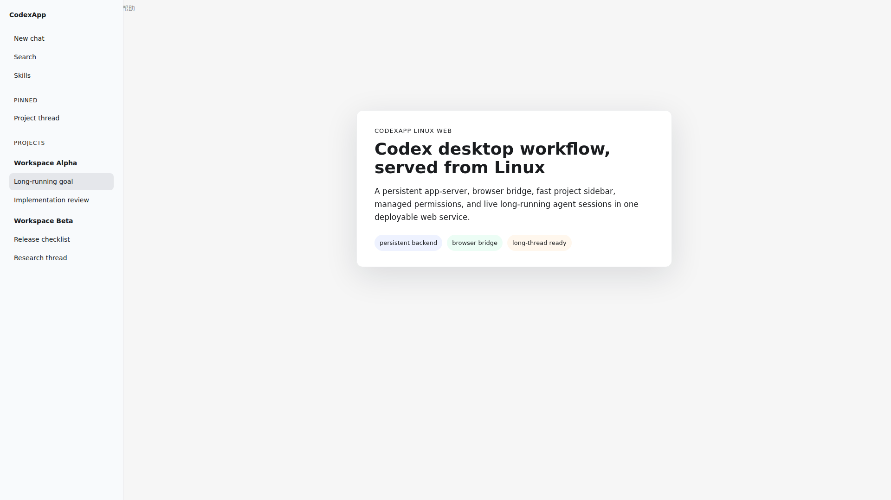
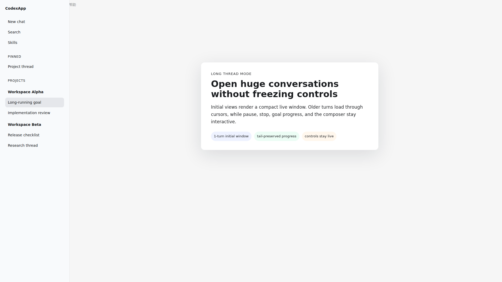

# codexapp-linux-web

A Linux web bridge for the Codex desktop app experience. It serves the Codex webview over HTTPS, connects it to a persistent local `codex app-server`, and adds the production glue needed for long-running agent sessions: stable permissions, fast thread lists, paged history, live turn recovery, and browser-safe asset patching.



## Highlights

- **Real Codex UI in the browser** - serves the bundled Codex webview with a local bridge for host APIs, filesystem access, config state, and remote-control messages.
- **Persistent backend** - keeps `codex app-server` alive behind systemd so long goals survive web bridge restarts.
- **Fast long threads** - reads large rollout files in small cursor pages instead of forcing the browser to hydrate an entire transcript.
- **Responsive history loading** - older turns load on upward scroll while the current window, composer, and active turn keep updating.
- **Full access normalization** - maps the web UI's permission mode into the managed local runtime policy and prevents approval-mode drift.
- **Production safety rails** - ignores bad ephemeral-thread classifications for persisted conversations, repairs stale turn IDs, and avoids uploading runtime state or secrets.



## Architecture

```text
browser
  |
  | HTTPS / WebSocket
  v
nginx
  |
  v
web-server.js
  |-- static Codex webview assets
  |-- browser bridge and host API shim
  |-- SQLite thread index and rollout fast path
  |-- permission and config sanitizers
  |
  v
codex app-server --remote-control
  |
  v
CODEX_HOME sessions, config, tools, workspaces
```

## Runtime Layout

This repo is intentionally small. Runtime data stays outside git.

| Path | Purpose |
| --- | --- |
| `web-server.js` | HTTP/WebSocket bridge, asset patcher, thread fast path, host API shim. |
| `systemd/` | Production units for the web bridge and persistent app-server. |
| `docs/assets/` | README screenshots, redacted before commit. |
| `state/` | Local runtime state. Ignored. |
| `output/` | Generated artifacts and test output. Ignored. |

## Requirements

- Linux host with Node.js 20+
- Global Codex CLI, currently verified with `@openai/codex` `0.141.0`
- A persistent `CODEX_HOME`
- Reverse proxy for TLS, usually nginx
- A secrets file outside the repo, for example `/etc/codexapp-linux-web/codexapp.env`

## Local Run

```bash
npm install

export CODEX_HOME="$HOME/.codex"
export CODEXAPP_WEBVIEW_DIR=/opt/codex-desktop/content/webview
export CODEXAPP_CODEX_PACKAGE_JSON=/usr/lib/node_modules/@openai/codex/package.json
export CODEXAPP_EXTERNAL_APP_SERVER=1
export CODEXAPP_WEB_PORT=13913

codex app-server --remote-control --listen ws://127.0.0.1:12911
node web-server.js
```

Then open `http://127.0.0.1:13913`.

## Production Deploy

```bash
sudo install -d -m 0755 /opt/codexapp-linux-web /var/lib/codexapp-linux-web /var/log/codexapp-linux-web /etc/codexapp-linux-web
sudo install -m 0644 systemd/codexapp-app-server.service /etc/systemd/system/
sudo install -m 0644 systemd/codexapp-web-green.service /etc/systemd/system/

sudo systemctl daemon-reload
sudo systemctl enable --now codexapp-app-server.service
sudo systemctl enable --now codexapp-web-green.service

curl -fsS http://127.0.0.1:13913/health
```

The web bridge can be restarted independently:

```bash
sudo systemctl restart codexapp-web-green.service
```

The app-server is intentionally separate so active Codex tasks keep running.

## Long Thread Strategy

Large transcripts are handled as a window, not as a full-document load:

- initial open returns a small recent page from the rollout file;
- `olderCursor` points to the next historical slice;
- upward scroll calls the page-side loader for one older page at a time;
- React state merges older pages without letting short snapshots overwrite loaded history;
- persisted threads cannot be incorrectly remembered as ephemeral.

This keeps the UI usable for multi-hour or multi-day sessions.

## Verification

Latest real-browser checks were run against a production deployment on 2026-06-21:

- opened ReadLayer long thread and paged history through multiple `codexapp-large-rollout:*` cursors;
- opened opencodexapp long thread without a 5-minute full hydrate;
- sent a new web message and received the expected response;
- confirmed no new persisted-thread `remembered ephemeral thread` entries after the fix;
- checked `node --check web-server.js`;
- confirmed installed Codex CLI matches npm latest: `0.141.0`.

## Security Notes

- `.env`, `*.env`, `state/`, `output/`, `node_modules/`, logs, and local browser traces are ignored.
- Keep API keys in an external `EnvironmentFile`, never in this repo.
- README screenshots are redacted before commit.
- Run a staged diff scan before pushing:

```bash
git diff --cached --no-color | rg -n "sk-|ghp_|github_pat_|BEGIN .*PRIVATE|Authorization: Bearer|OPENAI_API_KEY|api[_-]?key" || true
```

## License

Private repository unless a license is added.
