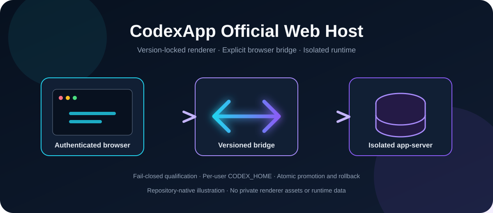
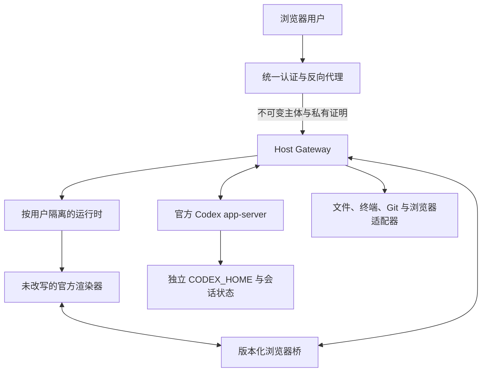
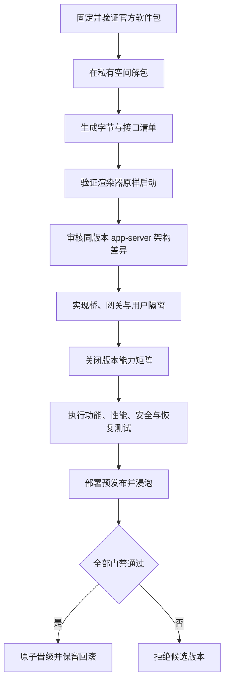

<div align="center">
  

# CodexApp Official Web Host

**把版本锁定的官方桌面渲染器接入浏览器，并为每名用户提供隔离、可审计、可回滚的运行环境**

[](https://github.com/AIALRA-0/codexapp-linux-web/actions/workflows/ci.yml)
[](package.json)
[](package.json)
[](manifests/official-26.721.31836.json)
[](LICENSE)

[English](README.en.md) · [系统结构](#5-系统结构) · [质量门禁](#7-质量门禁) · [本地验证](#8-本地验证) · [发布边界](#10-发布回滚)
</div>

<div align="center">
  <sub>图 1　浏览器、兼容桥与隔离 app-server 之间的边界</sub>
</div>

## 1 项目定位

`codexapp-linux-web` 是 CodexApp 的 Linux Web 兼容主机，它替代旧的自定义 Web 客户端，但不重新实现官方用户界面 [1]

项目把未经改写、经过版本锁定的官方 ChatGPT/Codex 桌面渲染器放在浏览器兼容层之后，并连接匹配版本的官方 Codex app-server

浏览器只接触明确声明且经过审核的桥接能力

官方 ChatGPT 应用、渲染器、图片、字体和 Codex 二进制文件不在本仓库中，也不受本仓库 MIT 许可证覆盖

运营者必须自行取得有权使用的官方软件包，并在部署前完成来源和完整性验证 [2]

## 2 核心原则

<div align="center">

表 2.1　不可协商的系统约束

| 约束             | 仓库如何执行                                                          | 失败时的结果                           |
| ---------------- | --------------------------------------------------------------------- | -------------------------------------- |
| 官方界面保持原样 | JavaScript、CSS、图片、字体和源 HTML 作为不可变构建输入               | 任一字节与清单不符即停止服务或阻止晋级 |
| 运行时改动可审计 | 只允许在确定性运行副本中注入已审核的桥接启动标签，签名源文件保持不变  | 未登记的改动无法进入发布流程           |
| 协议显式且版本化 | 浏览器到主机的每个方法均写入固定契约，未知方法直接失败                | 新旧版本差异会显式暴露，不会静默降级   |
| 用户运行环境隔离 | 每名已认证用户拥有独立运行时、工作区、浏览器配置、终端和 `CODEX_HOME` | 跨用户访问按失败关闭原则拒绝           |
| 私有材料不入库   | 官方软件包、解包资产、会话、凭据、追踪和运行状态不提交到 Git          | 仓库本身不能还原用户或生产环境         |
| 发布可恢复       | 候选版本先验证，再从验证环境晋级到预发布和生产，并保留已测回滚版本    | 晋级失败自动恢复上一版本               |
| 删除边界明确     | 旧 CodexApp 与 OpenCodexApp 属于独立资产域                            | 本项目脚本不得越界删除旧系统状态       |

</div>

## 3 已验证版本

<div align="center">

表 3.1　当前资格验证基线

| 组成部分             | 锁定值                      | 验证位置                                                                                                         |
| -------------------- | --------------------------- | ---------------------------------------------------------------------------------------------------------------- |
| ChatGPT/Codex 渲染器 | `26.721.31836`，构建 `5828` | [`manifests/official-26.721.31836.json`](manifests/official-26.721.31836.json)                                   |
| Electron             | `42.3.0`                    | 官方软件包资格清单                                                                                               |
| Chromium             | `150.0.7871.128`            | 官方软件包资格清单                                                                                               |
| Codex app-server     | `0.146.0-alpha.3.1`         | 主机启动检查                                                                                                     |
| 预加载接口           | 19 个方法                   | [`manifests/preload-contracts/preload-26.721.31836.json`](manifests/preload-contracts/preload-26.721.31836.json) |
| 仓库运行时           | Node.js `>=22 <25`          | [`package.json`](package.json)                                                                                   |

</div>

主机同时核对软件包身份、渲染器字节、主机字节、预加载契约和 app-server 版本，任何一项偏离资格基线都会失败关闭 [2]

## 4 能力范围

<div align="center">

表 4.1　能力归属与证据

| 能力域           | 权威实现                   | 本仓库承担的工作                                 |
| ---------------- | -------------------------- | ------------------------------------------------ |
| 对话与任务       | 官方 app-server            | 连接、排序、重放、断线恢复和隔离                 |
| 审批             | 官方 app-server 与模型回合 | 把接受或拒绝结果完整返回模型，并验证命令执行边界 |
| 模型、技能与 MCP | 官方 app-server            | 提供隔离配置和显式桥接通道                       |
| 文件、终端与 Git | 主机适配器                 | 通过能力处理器提供受限的桌面替代接口             |
| 应用内浏览器     | 浏览器运行时适配器         | 执行来源、权限、下载和窗口边界                   |
| 用户身份         | 外层统一认证               | 只接受反向代理确认的不可变主体和私有证明         |
| OpenAI 登录      | 官方设备授权流程           | 原样传递设备码结果，用户主动选择打开验证页面     |

</div>

外层统一登录与 OpenAI 账户登录相互独立，用户名变化不会迁移或遗失用户数据，浏览器也不会持有反向代理到主机之间的私有证明

## 5 系统结构

<div align="center">


```mermaid
%% 从外层认证到官方 app-server 的主链路
flowchart TB
    User[浏览器用户] --> Gateway[统一认证与反向代理]
    Gateway -->|不可变主体与私有证明| Host[Host Gateway]
    Host --> Runtime[按用户隔离的运行时]
    Runtime --> Renderer[未改写的官方渲染器]
    Renderer <--> Bridge[版本化浏览器桥]
    Bridge <--> Host
    Host <--> Server[官方 Codex app-server]
    Server --> State[独立 CODEX_HOME 与会话状态]
    Host --> Adapters[文件、终端、Git 与浏览器适配器]
```

图 5.1　认证、渲染、桥接和状态隔离链路

</div>

运行链路共有七个明确阶段 [3]

- 第一步，外层统一网关完成浏览器会话认证，并替换所有受信身份请求头

- 第二步，主机校验网关证明，把不可变身份主体映射到独立运行时

- 第三步，未改写的官方渲染器与同版本兼容启动层一起加载

- 第四步，浏览器桥复现资格验证版本的预加载契约，并发送带帧号和顺序号的消息

- 第五步，Host Gateway 通过标准输入输出管理该用户的官方 app-server 进程

- 第六步，app-server 管理对话、回合、审批、MCP、技能、模型、配置和账户状态

- 第七步，文件系统、终端、Git、菜单和系统集成交给显式能力处理器

## 6 仓库地图

<div align="center">

表 6.1　维护入口

| 路径                                                       | 内容                       | 维护提示                                |
| ---------------------------------------------------------- | -------------------------- | --------------------------------------- |
| [`apps/host`](apps/host)                                   | Web 主机入口               | 装配配置、网关和运行时                  |
| [`packages/browser-bridge`](packages/browser-bridge)       | 浏览器兼容桥               | 维护导航、文件协议、重连和有序消息      |
| [`packages/host-gateway`](packages/host-gateway)           | 主机能力与隔离             | 覆盖身份、状态、终端、Git、审批和持久化 |
| [`packages/app-server-client`](packages/app-server-client) | app-server 客户端          | 维护官方协议交互                        |
| [`packages/official-package`](packages/official-package)   | 私有软件包检查工具         | 只处理运营者提供的授权输入              |
| [`packages/contracts`](packages/contracts)                 | 共享类型与契约             | 固定浏览器和主机之间的边界              |
| [`manifests`](manifests)                                   | 资格清单与预加载契约       | 版本升级时必须重新生成和审核            |
| [`scripts`](scripts)                                       | 九组真实运行时冒烟测试     | 覆盖界面、隔离、审批、MCP 和生命周期    |
| [`ops`](ops)                                               | 安装、晋级、回滚和系统加固 | 生产执行前先阅读部署说明                |
| [`security`](security)                                     | 所有权与禁止路径           | 删除或迁移前先核对资产边界              |

</div>

## 7 质量门禁

GitHub Actions 在 Node.js 24 上执行不依赖私有官方软件包的仓库检查，包括来源边界、格式、代码规则、类型、单元测试和高危生产依赖审计 [4]

<div align="center">

表 7.1　门禁分层

| 层级       | 典型检查                                          | 执行环境              | 是否可被下一层替代 |
| ---------- | ------------------------------------------------- | --------------------- | ------------------ |
| 仓库检查   | 格式、代码规则、类型、单元测试、来源边界          | GitHub Actions 或本地 | 否                 |
| 软件包资格 | 签名、版本、ASAR 完整性、SHA-256、预加载契约      | 私有构建环境          | 否                 |
| 真实运行时 | 官方主窗口、浏览器、app-server、审批、MCP、持久化 | 隔离验证环境          | 否                 |
| 安全与恢复 | 用户隔离、伪造身份拒绝、备份恢复、磁盘压力        | 预发布环境            | 否                 |
| 发布       | 可见界面、性能、浸泡、回滚演练                    | 与生产等价的候选环境  | 否                 |

</div>

完整门禁还覆盖合成对话历史的分页上限、消息序列重放、设备码登录、浏览器权限、跨身份下载拒绝、服务重启后的已提交回合恢复，以及故障版本自动回滚 [5]

注：发布门禁使用 10,000 条合成对话验证分页边界，该测试规模来源见 [5]

## 8 本地验证

仓库基础检查不需要私有官方软件包

```bash
npm ci # 按锁文件安装依赖
npm run ci # 执行来源边界、格式、代码规则、类型和单元测试
npm run contracts:check # 核对浏览器桥与固定契约
```

真实运行时检查需要与资格清单匹配、由运营者合法取得的私有软件包，并应在隔离的预发布环境执行

```bash
npm run smoke:official-ui # 验证真实主窗口、非空像素和桥接就绪信号
npm run smoke:browser # 验证应用内浏览器边界
npm run smoke:auth-isolation # 验证用户身份和运行时隔离
npm run smoke:core-lifecycle # 验证对话与回合生命周期
npm run smoke:desktop-tools # 验证文件、终端、Git 和附件能力
npm run smoke:approvals # 验证接受与拒绝均完整返回模型
```

主窗口冒烟测试必须经过回环反向代理，浏览器不应接触私有代理证明

请勿把生产地址、真实身份请求头或秘密文件路径写入命令、日志、截图或问题记录

## 9 资格验证顺序

<div align="center">


```mermaid
%% 从来源固定到生产晋级的门禁顺序
flowchart TB
    Pin[固定并验证官方软件包] --> Extract[在私有空间解包]
    Extract --> Manifest[生成字节与接口清单]
    Manifest --> Render[验证渲染器原样启动]
    Render --> Schema[审核同版本 app-server 架构差异]
    Schema --> Bridge[实现桥、网关与用户隔离]
    Bridge --> Parity[关闭版本能力矩阵]
    Parity --> Suites[执行功能、性能、安全与恢复测试]
    Suites --> Stage[部署预发布并浸泡]
    Stage --> Promote{全部门禁通过}
    Promote -->|是| Production[原子晋级并保留回滚]
    Promote -->|否| Reject[拒绝候选版本]
```

图 9.1　资格验证、预发布和生产晋级顺序

</div>

虚假响应、自研替代界面或跳过真实运行时测试都不能作为门禁证据

## 10 发布回滚

应用代码、官方软件包、运行工具、用户状态和秘密分别存放

候选版本先以不可选中的临时状态复制和验证，只有完成所有检查的不可变版本才能被原子切换为当前版本 [6]

晋级操作会再次验证候选版本、切换当前版本、重启服务并检查就绪状态，失败时恢复上一条已验证版本

用户状态始终位于发布目录之外，回滚不会转换用户数据

生产晋级前必须通过来源、界面、持久化、MCP、桌面工具、审批、浏览器加固、身份伪造拒绝、设备码登录、故障回滚和备份恢复等全部门禁 [5]

## 11 安全边界

- 仓库不得包含官方软件包、解包素材、用户对话、登录凭据、秘密请求头、追踪或运行时状态

- README 不展示实际部署网址、生产主机、真实用户标识、账户信息、秘密文件路径或服务端目录

- 官方界面截图可能同时包含受版权保护的素材与私人会话，因此本 README 使用仓库自有的抽象架构图，不伪造产品截图

- 旧 CodexApp 退役属于单独的清单驱动操作，执行删除前必须停止写入、完成加密备份、核对所有权清单，并保留 OpenCodexApp 的独立数据 [7][8]

- 任何安全问题都应使用 GitHub 的私密漏洞报告渠道，公开 Issue 中不得粘贴令牌、配置、日志、截图或用户内容

## 12 当前状态

仓库版本为 `0.1.0`，默认分支为 `main`，主机代码采用 MIT 许可证 [9]

当前资格验证基线固定在表 3.1 所列版本，版本升级需要重新检查来源清单、接口契约、真实运行时、性能、安全、恢复和回滚

GitHub CI 只能证明不依赖私有软件包的仓库检查，不能替代预发布验证

本项目仍依赖运营者自行取得的官方软件包和合法授权，仓库不会分发这些材料，也不承诺未列入资格清单的版本兼容性

## 13 参考资料

[1] AIALRA-0, “CodexApp Official Web Host project overview,” `README.md`, 2026

[2] AIALRA-0, “Qualified official package manifest,” [`manifests/official-26.721.31836.json`](manifests/official-26.721.31836.json), 2026

[3] AIALRA-0, “End-to-end implementation,” [`docs/IMPLEMENTATION.md`](docs/IMPLEMENTATION.md), 2026

[4] AIALRA-0, “Repository CI workflow,” [`.github/workflows/ci.yml`](.github/workflows/ci.yml), 2026

[5] AIALRA-0, “Release gates,” [`docs/RELEASE-GATES.md`](docs/RELEASE-GATES.md), 2026

[6] AIALRA-0, “Versioned deployment and rollback,” [`docs/DEPLOYMENT.md`](docs/DEPLOYMENT.md), 2026

[7] AIALRA-0, “Filesystem ownership and deletion boundary,” [`security/OWNERSHIP.md`](security/OWNERSHIP.md), 2026

[8] AIALRA-0, “Old CodexApp retirement backup,” [`docs/OLD-CODEXAPP-BACKUP.md`](docs/OLD-CODEXAPP-BACKUP.md), 2026

[9] AIALRA-0, “MIT License,” [`LICENSE`](LICENSE), 2026
