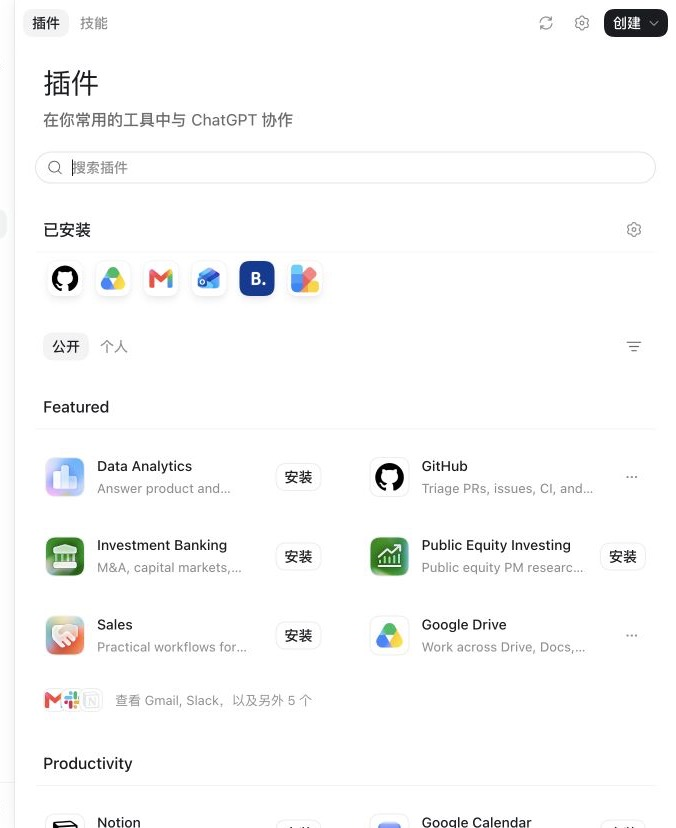
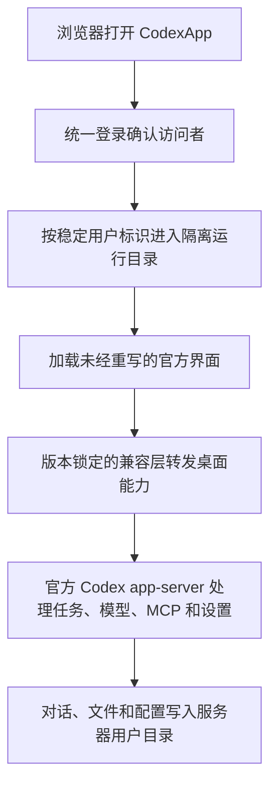

<div align="center">

# CodexApp Linux Web

把官方 ChatGPT / Codex 桌面界面放到 Linux 服务器上，让同一批任务可以在浏览器中持续使用

[](https://github.com/AIALRA-0/codexapp-linux-web/actions/workflows/ci.yml)
[](https://nodejs.org/)
[](./manifests/official-26.721.81911.json)
[](./LICENSE)

[它解决什么](#它解决什么) · [真实界面](#真实界面) · [实现方式](#实现方式) · [验证结果](#验证结果) · [部署与升级](#部署与升级) · [数据边界](#数据边界)

</div>

## 它解决什么

桌面端离线或设备不在身边时，任务会停在某一台电脑上

CodexApp Linux Web 把官方界面、官方 Codex app-server 和每个用户自己的运行目录放到服务器上，浏览器只负责显示和交互

项目坚持三条边界：

- 不重写一套相似的网页界面
- 不自建对话协议、历史索引或插件协议
- 不把官方安装包、账号凭据、真实对话和服务器状态提交到 GitHub

## 真实界面

下面两张图来自真实部署界面，只裁掉了包含账号和任务列表的侧栏，没有重绘界面或替换组件

### 对话、输入和消息操作


### 插件、技能和连接应用



## 实现方式

项目直接加载经过版本锁定和哈希校验的官方 renderer，也就是官方桌面客户端负责显示界面的那部分代码

浏览器兼容层只补齐桌面环境原本提供的能力，例如文件选择、终端、Git、工作树、浏览器控制和权限确认


```mermaid
flowchart TD
    A["浏览器打开 CodexApp"] --> B["统一登录确认访问者"]
    B --> C["按稳定用户标识进入隔离运行目录"]
    C --> D["加载未经重写的官方界面"]
    D --> E["版本锁定的兼容层转发桌面能力"]
    E --> F["官方 Codex app-server 处理任务、模型、MCP 和设置"]
    F --> G["对话、文件和配置写入服务器用户目录"]
```

这条链路让界面升级仍然以官方包为准，也让宿主代码可以单独测试、回滚和审计

## 已验证功能

| 范围     | 已验证结果                                                           |
| -------- | -------------------------------------------------------------------- |
| 登录     | 统一登录与 OpenAI 官方设备登录分离，用户之间不能互用会话票据         |
| 任务     | 新建、发送、读取、搜索、分支、归档、恢复、删除和服务重启后恢复       |
| 历史记录 | 最近任务、搜索结果、长任务读取和浏览器断线重连                       |
| 文件     | 上传、附件、文件夹、图片、预览、下载和跨用户下载拒绝                 |
| 开发工具 | 终端、Git 状态、差异、分支和受管工作树                               |
| 权限     | 命令批准、拒绝、浏览器来源权限和完全控制开关                         |
| MCP      | MCP 模型上下文协议（Model Context Protocol）发现、握手和真实工具调用 |
| 插件     | 插件目录、已安装插件、技能页和连接应用读取                           |
| 页面     | 新任务、拉取请求、站点、已安排、插件和全部设置页面                   |
| 运维     | 备份、恢复、不可变发布、健康检查和失败自动回滚                       |

自动化仓库检查当前覆盖 44 个测试文件和 215 个测试

真实运行环境还会执行官方窗口、任务生命周期、MCP、权限、文件、终端、Git、浏览器、备份恢复和持久化烟雾测试

完整证据与未执行的高风险操作见 [端到端验收记录](./docs/USER-JOURNEY-AUDIT-2026-07-29.md)

## 性能边界

宿主曾把所有桌面调用排成一条队列，导致一个慢网络请求拖住本地按钮、历史记录和发送操作

修复后，独立调用可以并发执行，同时保留需要顺序处理的确认和端口消息

| 项目                           |                  验收结果 |
| ------------------------------ | ------------------------: |
| 服务器本地桥接延迟中位数       |                   13.0 ms |
| 服务器本地桥接延迟第 95 百分位 |                   25.9 ms |
| 已登录任务切换                 |                 44–162 ms |
| 发送到收到准确回复             | 3.56–4.41 s，包含模型生成 |
| 创建对话分支                   |                    342 ms |
| 归档测试分支                   |                    771 ms |

另外从 Mac 取一条约 450 MiB 的真实旧任务，经过逐字节校验后放入服务器隔离目录封测：

| 约 450 MiB 真实旧任务       | 服务器内部耗时 |
| --------------------------- | -------------: |
| 启动官方 app-server         |         0.59 s |
| 列出最近任务                |          16 ms |
| 读取任务元数据              |          23 ms |
| 按最新官方界面恢复最近 5 轮 |         31.6 s |
| 返回页面数据                |        6.37 MB |
| app-server 进程树峰值内存   |        1.23 GB |

这条任务可以完整读取，不丢内容，也没有超时，但不适合当作日常在线任务

瓶颈是官方 app-server 重复解析超大 JSONL 文件，不是浏览器桥接或公网往返

项目不会为了掩盖这个上游限制再维护一套私有历史数据库，旧任务应先备份，需要时再恢复

2026-08-03 的真实使用复验还定位并清除了三段额外延迟：官方文件读取通道缺失、动态工具能力没有传给官方界面，以及公网 WebSocket 每约 60 秒被回收。修复后真实账号页面连续在线超过 190 秒，新任务正常启动，期间没有再次出现这三类错误。完整证据和剩余人工授权项见 [2026-08-03 发布复验](./docs/VALIDATION-2026-08-03.md)

## ChatGPT 项目列表

VPS 使用普通服务器网络请求访问 ChatGPT 项目列表时会收到 Cloudflare 403 挑战

项目没有伪造项目数据，也没有改写官方接口，而是为官方 renderer 的完整
`https://chatgpt.com/backend-api/` 边界启动版本锁定的 Electron 网络进程：

- 只允许官方 `chatgpt.com` 主机和 `/backend-api/` 路径，拒绝自定义端口、Cookie 和跳转到其他主机
- 按官方请求保留 `GET`、`POST`、`PUT`、`PATCH`、`DELETE`、`HEAD` 和 `OPTIONS`，并支持流式响应
- 使用 Electron 43.2.0 和 Chromium 150.0.7871.129，与官方客户端的 Chromium 150 主版本一致
- 进程长期复用，避免每次点击都重新启动浏览器内核
- 不继承宿主服务的账号和服务器密钥，OpenAI 访问令牌只通过父子进程管道传递
- 不保存或携带浏览器 Cookie，不复用账号相关响应缓存
- 保留 Chromium 用户命名空间沙箱，不使用 `--no-sandbox`
- Ubuntu 只对这个不可变、由 root 管理的可执行文件开放用户命名空间，系统全局限制保持开启

版本对应关系来自 [Electron 43.2.0 官方发布记录](https://releases.electronjs.org/release/v43.2.0)，Ubuntu 的按文件开放方式来自 [Chromium 官方 AppArmor 说明](https://chromium.googlesource.com/chromium/src/+/main/docs/security/apparmor-userns-restrictions.md)

真实登录态下，普通请求返回 403；同一账号通过生产 renderer 路由返回 200 和有效 JSON

`.08` 发布后的真实复验中，冷启动约 1.36 秒，复用连接约 1.04 秒，完整宿主路由约 0.89 秒

Cloudflare WARP 已从生产依赖中移除并停用

## 验证结果

仓库级检查：

```sh
# 安装锁定依赖
npm ci

# 运行安全、格式、静态检查、类型检查和全部单元测试
npm run ci

# 用获得授权的官方包核对版本、哈希和桌面契约
npm run contracts:check
```

服务器候选版本还必须通过以下真实链路：

```sh
# 官方主窗口和浏览器兼容层
npm run smoke:official-ui
npm run smoke:browser

# 登录隔离、任务持久化和完整生命周期
npm run smoke:auth-isolation
npm run smoke:core-lifecycle

# 文件、终端、Git、工作树和权限
npm run smoke:desktop-tools
npm run smoke:approvals

# MCP 真实服务发现和调用
npm run smoke:mcp
```

GitHub 的 CI 持续集成（Continuous Integration）只验证不依赖私有官方包的部分

正式发布不能用 CI 代替服务器上的官方包、真实浏览器、备份恢复和重启持久化验收

## 部署与升级

仓库不包含官方安装包

部署者需要提供自己有权使用的官方包，并先生成来源清单、renderer 哈希和 preload 契约

发布流程按以下顺序执行：

1. 在独立目录构建候选版本
2. 执行仓库检查和官方包契约检查
3. 在隔离用户和临时端口上执行真实运行测试
4. 把通过验收的目录设为只读版本
5. 原子切换 `current` 链接并检查健康状态
6. 健康检查失败时自动切回上一版本

部署细节见 [部署与回滚](./docs/DEPLOYMENT.md)

## 登录与用户隔离

外层统一登录决定谁能进入站点，内层 OpenAI 登录决定 Codex 使用哪个 OpenAI 账号

两层登录不共用令牌

每个稳定用户标识对应独立的：

- `CODEX_HOME`
- 工作目录
- 对话和设置
- 浏览器配置
- 终端
- 下载票据
- GitHub CLI 登录

用户名变化不会改变稳定用户标识，因此不会让原任务消失

## 数据边界

仓库允许提交：

- 宿主源代码
- 版本与契约清单
- 部署脚本
- 脱敏后的测试证据
- 裁掉账号和任务侧栏的公开截图

仓库禁止提交：

- 官方 ChatGPT / Codex 安装包及其解包文件
- OpenAI、GitHub、Authentik 或代理凭据
- 真实对话、附件和浏览器资料
- 用户运行目录、数据库、日志和备份
- 服务器私有密钥、内部地址和临时授权码

提交前检查由 [`ops/check-source-boundaries.sh`](./ops/check-source-boundaries.sh) 执行

## 当前外部边界

以下能力不能靠改写官方界面解决：

- 公开插件目录的在线刷新仍可能被 OpenAI 拒绝机房出口；已安装插件、连接应用和官方缓存不受影响
- 语音和 Computer Use 需要连接设备提供麦克风、摄像头或屏幕权限
- 付费操作、账号删除和不可恢复删除不会进入无人值守测试

服务器用户的 GitHub OAuth 已完成，`gh auth status`、拉取请求读取、Git 状态、差异和工作树链路均已通过

ChatGPT 项目列表的真实登录态业务响应已经通过，不再依赖 WARP 或自建项目数据库

## 文档

- [实现与模块边界](./docs/IMPLEMENTATION.md)
- [发布关卡](./docs/RELEASE-GATES.md)
- [部署与回滚](./docs/DEPLOYMENT.md)
- [Codex 统一工作区规则](./ops/workspace/README.md)
- [MCP 迁移与重新连接](./docs/MCP-MIGRATION-2026-08-03.md)
- [生产端到端验收记录](./docs/USER-JOURNEY-AUDIT-2026-07-29.md)
- [2026-08-03 发布复验](./docs/VALIDATION-2026-08-03.md)
- [2026-07-31 发布复验](./docs/VALIDATION-2026-07-31.md)
- [2026-07-30 发布复验](./docs/VALIDATION-2026-07-30.md)
- [旧 CodexApp 备份边界](./docs/OLD-CODEXAPP-BACKUP.md)

## 已锁定上游版本

- ChatGPT / Codex renderer：`26.721.81911`
- 官方构建号：`5973`
- Codex app-server：`0.146.0-alpha.3.1`
- preload 契约：19 个方法
- 项目列表网络进程：Electron `43.2.0`、Chromium `150.0.7871.129`

宿主发现版本、哈希、品牌、构建号或契约不一致时会拒绝启动

## 许可

本仓库自有代码使用 [MIT License](./LICENSE)

官方 ChatGPT / Codex 界面、图片、字体、安装包和二进制文件不属于本仓库，也不受本仓库 MIT 许可覆盖
